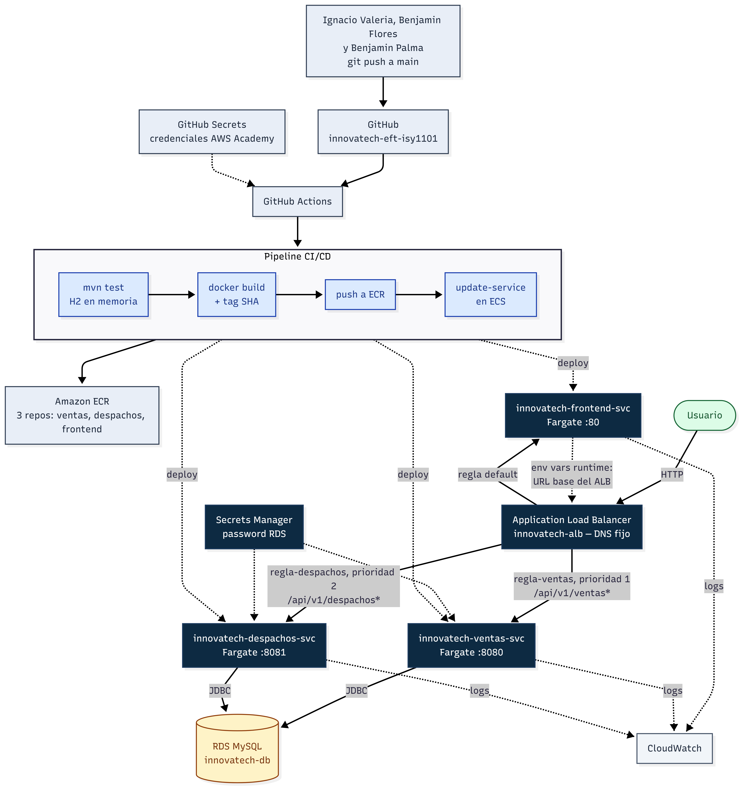

# Innovatech Chile

Proyecto desarrollado para la Evaluación Final Transversal (EFT) de la asignatura ISY1101 Introducción a Herramientas DevOps, de la carrera de Ingeniería en Informática en DUOC UC sede Concepción. El objetivo principal del proyecto es automatizar el ciclo de construcción, integración y despliegue de una plataforma web destinada al control de ventas y gestión de despachos.

El sistema está dividido en tres componentes principales: dos microservicios desarrollados en Java con Spring Boot (API de Ventas y API de Despachos) y una aplicación frontend de página única desarrollada con React y Vite. Cada servicio backend administra su propia base de datos relacional para mantener un desacoplamiento adecuado.

## Arquitectura y Servicios



- **backend-ventas** (puerto 8080): Servicio REST encargado de la gestión de órdenes y compras. Almacena la información en el esquema `ventas_db`.
- **backend-despachos** (puerto 8081): Servicio REST que administra la logística, seguimiento e intentos de entrega de los productos. Utiliza el esquema `despachos_db`.
- **frontend** (puerto 5173 en local / puerto 80 en nube): Interfaz web en React servida mediante Nginx, que se comunica de forma asíncrona con ambos microservicios.
- **db**: Servidor MySQL 8.0 para el entorno local, inicializado de manera automática mediante el script `db/init.sql`.

## Estructura del repositorio

```
innovatech-chile-ET/
├── .github/workflows/        # Archivo de automatización CI/CD (deploy.yml)
├── back-Despachos_SpringBoot/ # Código fuente y Dockerfile del servicio de despachos
├── back-Ventas_SpringBoot/    # Código fuente y Dockerfile del servicio de ventas
├── db/                       # Scripts de base de datos (init.sql y datos_prueba.sql)
├── docs/                     # Documentación visual y diagramas de arquitectura
├── ecs-taskdefs/             # Definiciones de tareas para AWS ECS Fargate
├── front_despacho/           # Código fuente y configuración Nginx/Docker del frontend
├── .env.example              # Archivo de ejemplo para variables de entorno locales
├── docker-compose.yml        # Orquestación de contenedores para entorno de desarrollo
└── README.md                 # Documentación del proyecto
```

## Entorno de Desarrollo Local

Para ejecutar el sistema en un entorno local, se requiere tener instalado Docker y Docker Compose.

1. Clonar el repositorio y entrar al directorio del proyecto:
```bash
git clone https://github.com/Nachovn12/innovatech-eft-isy1101.git
cd innovatech-chile-ET
```

2. Copiar el archivo de configuración de variables de entorno:
```bash
cp .env.example .env
```
Por motivos de seguridad, el archivo `.env` se encuentra excluido del control de versiones. Se deben completar las contraseñas y parámetros correspondientes antes de iniciar los servicios.

3. Construir e iniciar el stack de microservicios:
```bash
docker-compose up --build
```

4. Para corroborar que los cuatro contenedores se encuentran en ejecución:
```bash
docker-compose ps
```

### Carga de datos de prueba en local

Para inyectar registros iniciales de prueba en la base de datos local sin necesidad de ingresar manualmente desde la aplicación, se puede ejecutar el script SQL provisto enviándolo al contenedor de MySQL:

```bash
Get-Content db\datos_prueba.sql | docker exec -i innovatech-db mysql -u innovatech -pinnovatech_local_2026
```

### Enlaces de acceso local
- Aplicación web (Frontend): http://localhost:5173
- API REST Ventas: http://localhost:8080/api/v1/ventas
- API REST Despachos: http://localhost:8081/api/v1/despachos

## Demostración en Vivo (Entorno Cloud AWS)

La aplicación se encuentra desplegada en AWS ECS Fargate y es accesible públicamente a través de un Application Load Balancer (ALB), que expone un DNS fijo independiente de las IPs dinámicas de los contenedores:

**http://innovatech-alb-1599498572.us-east-1.elb.amazonaws.com**

El ALB enruta automáticamente las peticiones según la ruta solicitada:
- `/` → Frontend (React + Nginx)
- `/api/v1/ventas` → Microservicio de Ventas
- `/api/v1/despachos` → Microservicio de Despachos

> **Nota:** Este entorno corre sobre un AWS Academy Learner Lab, por lo que el enlace solo estará disponible mientras el laboratorio se encuentre en estado "Started". La conexión es HTTP (sin certificado SSL), ya que no se dispone de un dominio propio en este entorno académico.

## Entorno Cloud y Automatización CI/CD

Como parte de los requisitos de la asignatura, el proyecto no solo funciona en un entorno local, sino que cuenta con un proceso automatizado de despliegue en la nube pública de Amazon Web Services (AWS).

### Estrategia de Contenerización
Los servicios de backend implementan compilación multietapa en Docker. Primero, compilan el código fuente utilizando la imagen ligera `eclipse-temurin:17-jdk-alpine` a través de Maven Wrapper, ejecutando las pruebas unitarias en una base de datos en memoria (H2). Posteriormente, el artefacto `.jar` generado se traslada a una imagen final `eclipse-temurin:17-jre-alpine`, configurada para ejecutarse bajo un usuario sin privilegios de root por seguridad. El frontend, por su parte, compila los assets estáticos con Node 20 y los sirve a través de un servidor Nginx.

### Configuración en Tiempo de Ejecución (Runtime Configuration)
Para evitar la recompilación de la imagen Docker del frontend al cambiar entre el entorno local y la nube, se implementó una estrategia de configuración en tiempo de ejecución. El contenedor ejecuta un script de inicio (`entrypoint.sh`) que lee las variables de entorno definidas en el sistema e inyecta un objeto de configuración (`window.APP_CONFIG`) en el navegador. De este modo, la misma imagen estática de Nginx es capaz de apuntar dinámicamente al localhost en desarrollo o a las direcciones de un balanceador en AWS Fargate.

### Flujo de Integración y Despliegue (GitHub Actions -> AWS ECS)
El repositorio incluye el flujo de automatización `.github/workflows/deploy.yml`, configurado para dispararse tras cada integración en la rama principal (`main`):

1. **Pruebas y Compilación:** Se descargan los códigos de cada servicio y se validan las pruebas unitarias.
2. **Registro de Imágenes:** Se autentica y suben las nuevas imágenes Docker etiquetadas con el hash del commit hacia los repositorios en Amazon ECR.
3. **Despliegue en Fargate:** Se actualizan las definiciones de tarea (`Task Definitions`) ubicadas en la carpeta `ecs-taskdefs/` y se aplica el despliegue hacia un clúster de AWS ECS bajo la modalidad Fargate (serverless). La persistencia de datos en el entorno cloud está gestionada mediante una base de datos administrada Amazon RDS para MySQL.

## Integrantes

- Benjamín Flores
- Benjamín Palma
- Ignacio Valeria
